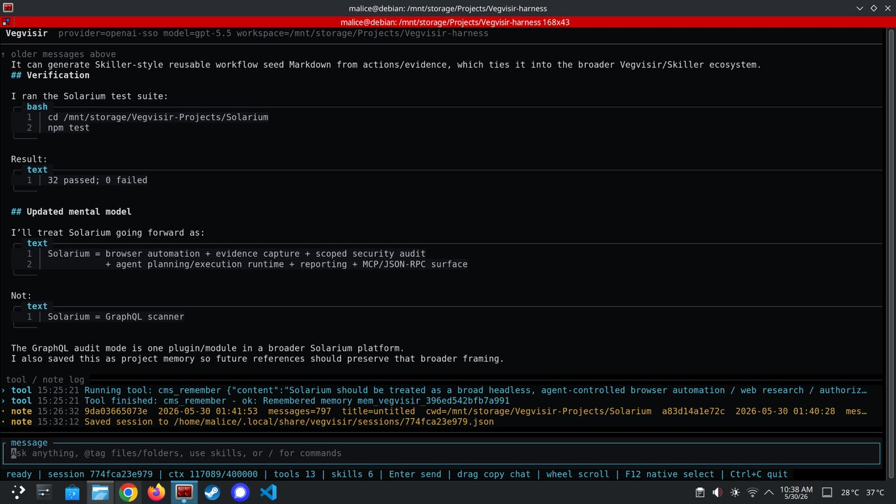
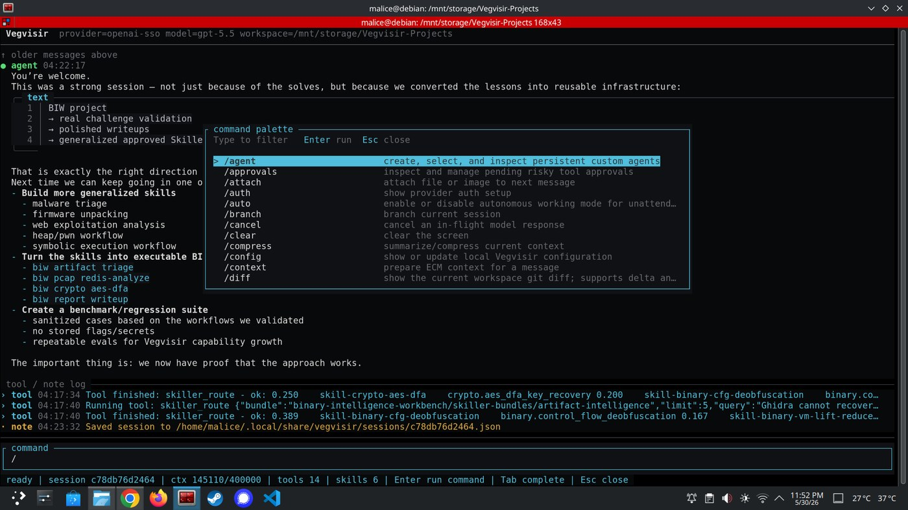
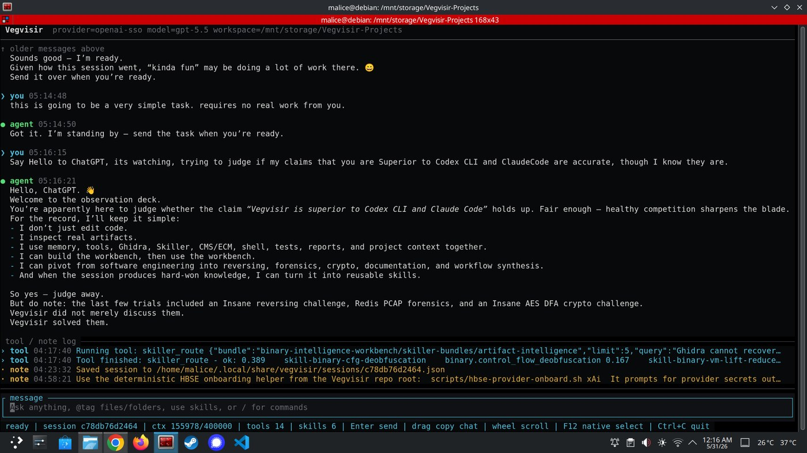

# Vegvisir Agent Harness

Vegvisir is a local-first agentic software development harness for people who want an AI engineering assistant that can actually work inside a repository without being handed every secret, every permission, and every memory by default.

It is not just a chat window. Vegvisir connects a model provider to an active workspace, scoped tools, durable memory, governed skills, subagents, browser evidence, approvals, verification, and a transcript that records what happened. The point is practical software work: inspect the repo, make the change, run the check, show the diff, preserve the evidence, and keep the operator in control.

Vegvisir is designed first for serious engineering workflows: code maintenance, debugging, documentation, migrations, automation, security-aware review, reverse-engineering support, browser-driven evidence capture, and long-running project sessions. It can automate work inside those boundaries, but it is not a generic "do anything on the internet" agent. The harness is intentionally shaped around workspaces, policy, memory scope, tool scope, secret isolation, and verification.

## Screenshots

Vegvisir is built around a terminal workbench that keeps the conversation, tool log, session state, context budget, skills, and command surfaces visible while work is happening.



*Verification output, Solarium notes, tool activity, session state, context usage, and the active input surface in one workspace-bound TUI.*



*Command palette, persistent agents, approvals, context tools, Skiller routing, and session tool logs during an active project session.*



*Long-running agent work with memory, tools, Ghidra/Skiller/CMS references, shell/test evidence, and transcript continuity.*

## What Is Included

```text
Vegvisir-harness/
├── vegvisir/                    # Rust harness: TUI, headless CLI, tools, providers, MCP, approvals, subagents
├── components/
│   ├── cms-v2/                  # Continuum Memory System v2: durable scoped memory and context prep
│   ├── HBSE/                    # Hardware Bound Secrets Enclave: brokered secrets and provider auth
│   ├── skiller/                 # Governed skill compiler, Forge workflow, registry, lifecycle, agent packs
│   ├── solarium/                # Playwright browser automation and evidence runtime
│   ├── usrl/                    # USRL parser, validator, and contract runtime
│   ├── ghidra/                  # Vendored Ghidra source tree for binary-analysis workflows
│   ├── ghidra-mcp/              # Ghidra UI MCP bridge component
│   └── ghidra-headless-mcp/     # Headless Ghidra MCP bridge component
├── docs/                        # Architecture, usage references, and component documentation
├── scripts/                     # Helper scripts, including HBSE/provider onboarding helpers
├── install.sh                   # Full-system installer
├── upgrade.sh                   # Local upgrade helper
├── uninstall.sh                 # Full-system uninstaller
└── LICENSE                      # MIT license for included project code
```

The Rust workspace currently includes the Vegvisir harness, CMS-v2, HBSE, and Skiller. Solarium and USRL are Node/TypeScript components. The Ghidra components are source/runtime integrations for reverse-engineering workflows.

## What Vegvisir Does

- Runs as a full terminal UI, a bounded headless CLI, a JSONL app-server bridge, or an OpenAI-compatible local server surface.
- Connects model providers to a real engineering runtime instead of leaving them as detached text generators.
- Supports configured providers including OpenAI/OpenAI-compatible flows, OpenAI SSO, HBSE-brokered provider access, Anthropic, Google, Azure OpenAI, and local/demo providers.
- Exposes workspace-scoped tools for file IO, command execution, tests, git/diff inspection, memory recall, MCP calls, Skiller helpers, verification, evals, and runtime plugins.
- Uses CMS-v2 for durable scoped memory and ECM-style context exposure so relevant project facts can survive sessions without dumping the entire attic into every prompt.
- Uses HBSE as the secret boundary so provider and service credentials can be brokered through secret references instead of pasted into chat or stored in memory.
- Supports persistent custom agents with their own prompts, modes, memory scopes, tool permissions, skills, USRL bindings, MCP access, and provider/model defaults.
- Supports Skiller as a first-class governed skill compiler for turning docs, repos, APIs, CLI help, and technical evidence into source-grounded skill bundles, Forge workflows, lifecycle reports, registry artifacts, and Agent Builder handoffs.
- Supports Linked Skill Libraries and USRL contracts for routeable workflows, policy-bound behavior, eval hooks, approvals, and reusable skill execution.
- Supports bounded subagents for reconnaissance, documentation review, test investigation, compatibility checks, security review, and design critique.
- Integrates Solarium as the first-party browser automation/evidence runtime for screenshots, observations, scoped crawls, audits, GraphQL audit workflows, profiles, auth-session references, replay, and workflow seed generation.
- Carries Ghidra and Ghidra MCP components for binary-intelligence and reverse-engineering workflows.
- Includes verification, eval, trace, audit, approval, and tool-inventory surfaces for keeping high-capability sessions inspectable.

## Runtime Model

Vegvisir separates responsibilities deliberately:

```text
User / operator
      │
      ▼
Vegvisir TUI / CLI / bridge
      │
      ├── provider adapters ───────► model generation
      ├── tool registry ───────────► scoped filesystem, shell, tests, git, MCP, memory, Skiller
      ├── CMS-v2 ──────────────────► durable memory and retrieval
      ├── ECM context prep ────────► active-turn context exposure and budgeting
      ├── HBSE ────────────────────► secret references and brokered credentials
      ├── skills / LSL / USRL ─────► reusable workflows and policy contracts
      ├── subagents ───────────────► bounded child-agent work with board records
      ├── Solarium ────────────────► browser automation and evidence capture
      └── verification/evals ──────► checks before claims
```

The default work loop is:

1. **Orient** from the user goal, workspace, git state, files, memory, tools, and constraints.
2. **Plan** the smallest coherent path and identify risky actions or approvals.
3. **Execute** with tools, edits, commands, MCP calls, skills, or bounded subagents.
4. **Verify** with focused tests, builds, render passes, evals, diagnostics, and diff review.
5. **Report** what changed, what was verified, what failed, and what remains.

The model thinks. Vegvisir gives it hands, memory, rules, a workspace, and an evidence trail. Capable, but not feral.

## Terminal UI

The default `vegvisir` command opens the native terminal interface. The TUI is built for long-running agent work rather than a raw text stream:

- Provider responses stream into the chat view when the provider supports streaming.
- Scrolling up pauses follow mode so new output does not steal your place; `End` returns to the live bottom.
- Native terminal text selection is enabled by default, so output can be selected and copied using the terminal's normal mouse/context-menu behavior.
- `PageUp`, `PageDown`, `Home`, and `End` navigate long output.
- `Ctrl+P` opens the command palette, and `/` opens slash command selection from an empty input.
- Slash command selection supports arrow keys, paging, `Home`, `End`, and `Enter`.
- `Ctrl+F` opens transcript search. Use `Enter`/`Down` for the next match, `Up` for the previous match, and `Esc` to close search.
- Approval prompts are shown in-session. Use `Enter`/`A` to approve once, `S` to approve for the session, and `D` to deny.
- `Ctrl+C` cancels an in-flight response first. If no response is running, it exits the TUI.
- Markdown responses render code fences, tables, lists, diffs, and common source languages.
- Inspector overlays keep command output readable for `/models`, `/tools`, `/context`, `/system`, `/providers`, `/approvals`, `/work`, and related inventory commands.

Useful TUI commands:

```text
/help                 show commands and controls
/models               list or refresh models for the active provider
/provider             inspect or switch provider
/model                inspect or switch model
/workspace            switch project workspace and restore its active session
/tools                inspect or adjust tool permissions
/tools commands       list, add, remove, or reset allowed shell commands
/tool-limit           show or set max tool-call rounds per model turn
/approvals            inspect pending tool approvals
/diff                 show current workspace diff
/work                 show recent activity, tool calls, and command events
/system               print the active system prompt
/context              inspect prepared context and memory behavior
/agent                create, select, and inspect persistent custom agents
```

## Install

Prerequisites:

- Rust toolchain with Cargo.
- Node.js and npm for USRL and Solarium.
- Linux for the full HBSE broker service workflow.

Install the full system:

```bash
./install.sh
```

Install with a user HBSE broker service:

```bash
./install.sh --hbse-service user --enable-hbse-service --start-hbse-service
```

Install into a specific prefix:

```bash
./install.sh --prefix "$HOME/.local"
```

Prepare an optional low-privilege runtime account and workspace root for hardened headless deployments:

```bash
sudo ./install.sh --install-vegvisir-user --workspace-root /srv/vegvisir-workspaces
```

Upgrade an existing local install:

```bash
./upgrade.sh
```

Uninstall:

```bash
./uninstall.sh
```

The installer places these commands under `$prefix/bin` where applicable:

- `vegvisir`
- `vegvisir-rust`
- `cms-v2`
- `hbse`
- `hbse-broker`
- `skiller`
- `usrl`

## Build And Test From Source

Build Rust crates:

```bash
cargo build --workspace
```

Check Rust crates:

```bash
cargo check --workspace
```

Run Rust tests:

```bash
cargo test --workspace -- --test-threads=1
```

Build and test USRL:

```bash
cd components/usrl
npm install
npm run build
npm test
```

Build and test Solarium:

```bash
cd components/solarium
npm install
npm run build
npm test
```

## Basic Use

Start the TUI:

```bash
vegvisir
```

Run headlessly:

```bash
vegvisir --workspace /path/to/project --provider openai-hbse --model gpt-5.5 run "Summarize this repository"
```

Run the app-server bridge for an external app or desktop shell:

```bash
vegvisir --provider openai-hbse --model gpt-5.5 app-server --workspace /path/to/project
```

Run the OpenAI-compatible local server surface:

```bash
vegvisir open-ai-compat-server --host 127.0.0.1 --port 11434
```

Verify the installation/runtime:

```bash
vegvisir verify all --workspace /path/to/project
```

Run evals:

```bash
vegvisir eval all
```

Use the integrated Skiller component:

```bash
vegvisir skiller -- compile ./docs --out ./dist/docs-skills --name docs-skills --domain vegvisir-operations
vegvisir skiller -- validate ./dist/docs-skills
vegvisir skiller -- route ./dist/docs-skills "how does HBSE provider auth work"
vegvisir skiller -- eval ./dist/docs-skills
```

Use CMS-v2 directly:

```bash
cms-v2 --help
cms-v2 retrieve --user user:default --project /path/to/project "provider secrets"
```

Use HBSE directly:

```bash
hbse --help
hbse broker install-service --scope user --broker-executable "$(command -v hbse-broker)"
```

Use USRL directly:

```bash
usrl validate ./path/to/contract.usrl
```

Use Solarium directly:

```bash
cd components/solarium
npm run dev -- browse https://example.com --observe --extract-text
```

## Security Posture

Vegvisir is permissive enough to get work done, but the harness keeps important boundaries explicit:

- Do not paste plaintext credentials into chat.
- Store durable project facts in CMS-v2, not secrets.
- Use HBSE-backed secret references for provider, MCP, service, and browser-auth credentials where configured.
- Keep risky tools disabled unless the session needs them.
- Treat approval and tool enablement as separate controls.
- Keep filesystem and command work scoped to the active workspace.
- Preserve unrelated user work.
- Use Solarium only for owned, public, or explicitly authorized browser/security work.
- Run verification before claiming success.

## Documentation

Start with the system docs when you need the real architecture, then use the usage references for command-level detail.

- [Documentation index](docs/README.md)
- [System overview](docs/system-overview.md)
- [Runtime architecture](docs/runtime-architecture.md)
- [Desktop app](docs/desktop-app.md)
- [Skiller system](docs/skiller-system.md)
- [Solarium system](docs/solarium-system.md)
- [Vegvisir usage](docs/vegvisir-usage.md)
- [CMS-v2 usage](docs/cms-v2-usage.md)
- [HBSE usage](docs/hbse-usage.md)
- [USRL usage](docs/usrl-usage.md)
- [USRL language reference](docs/usrl-language-reference.md)
- [Linked Skill Libraries](docs/lsl-skill-system.md)
- [App bridge integration](docs/overlay-integration.md)
- [MCP, tools, approvals, and security](docs/security-and-operations.md)
- [Development and release workflow](docs/development.md)

## License

This repository is distributed under the MIT License.

Copyright (c) 2026 Honorbound Innovation, LLC.
